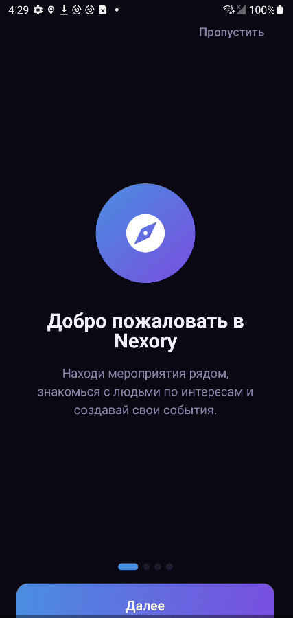
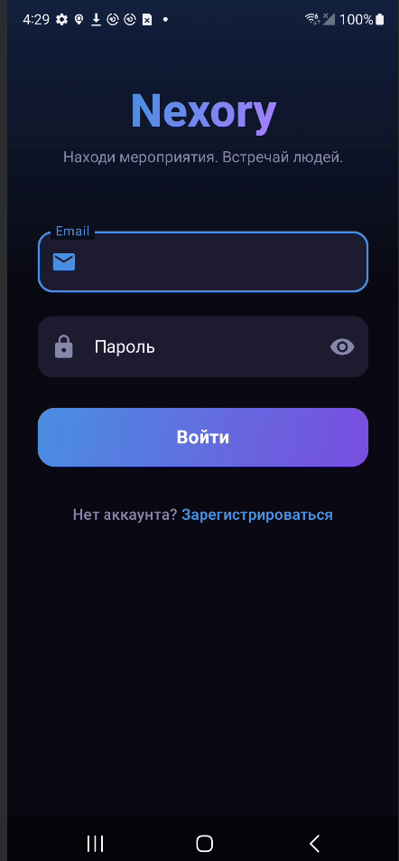
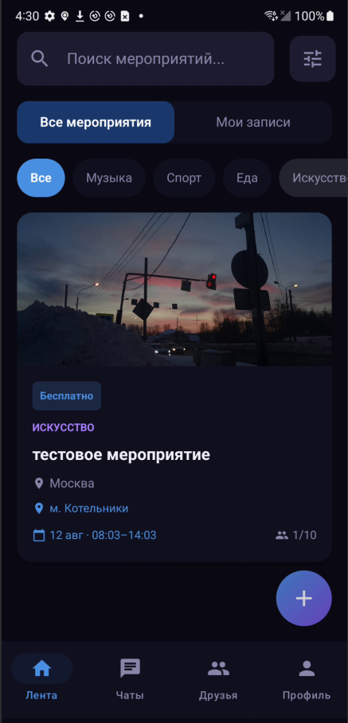
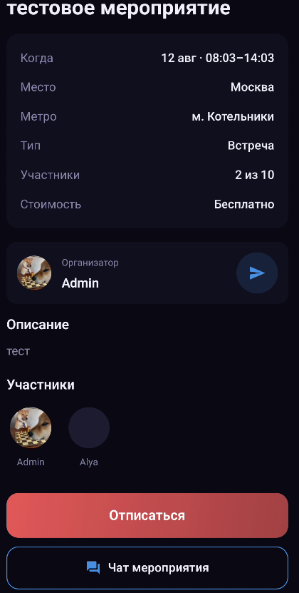
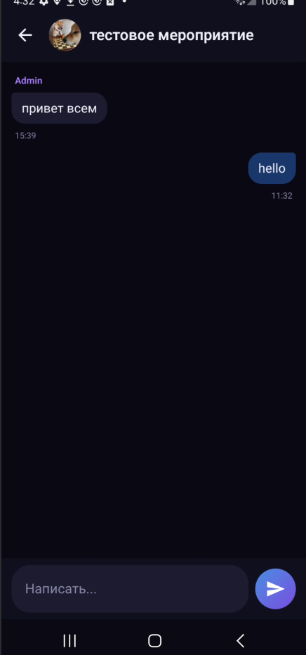
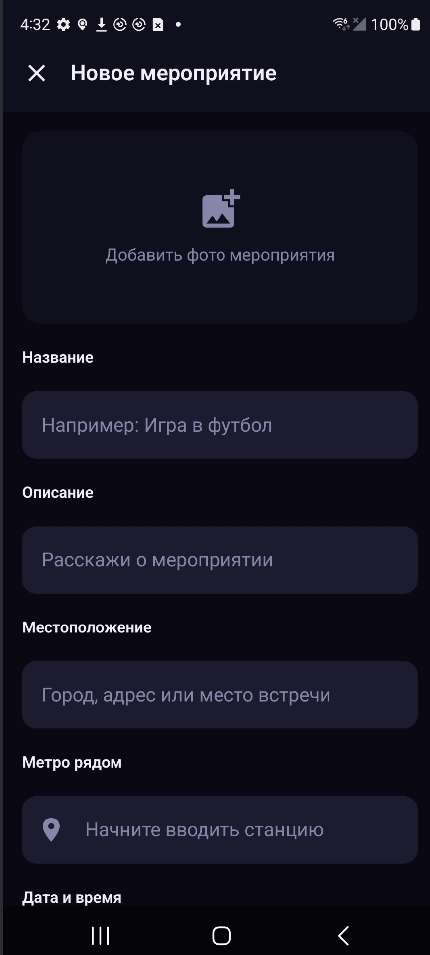
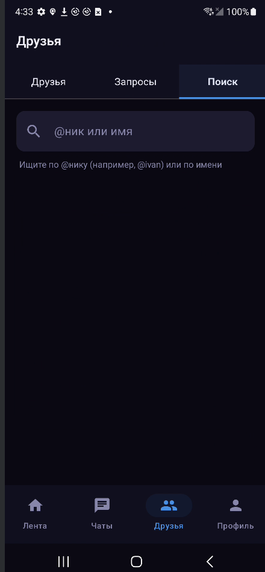
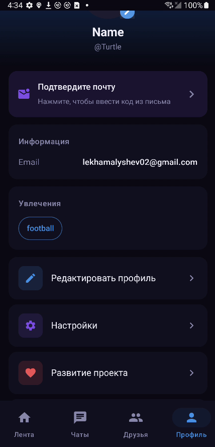
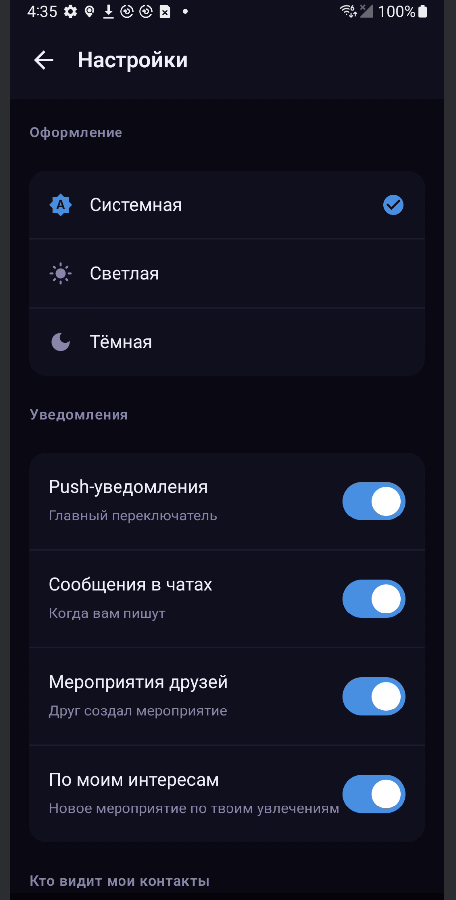

<div align="center">


# Nexory

Android-приложение для поиска и создания мероприятий: лента событий рядом, запись в один тап, чат с участниками и система друзей.

`Kotlin` `Jetpack Compose` `Node.js` `PostgreSQL` `WebSocket`

</div>

---

## Что это

Обычная ситуация — хочешь сходить куда-то вечером, но не знаешь куда и не с кем. Nexory решает это: лента мероприятий рядом с фильтрами по метро и интересам, запись одним нажатием, и сразу чат с остальными участниками — не нужно отдельно обмениваться контактами.

Написано полностью самостоятельно: схема БД, REST API, WebSocket-сервер для чатов, Android-клиент на Compose, деплой на VPS, публикация в RuStore.

Backend и приложение развёрнуты и рабочие — не просто код в репозитории, а живой сервис с базой данных, пуш-уведомлениями и почтой.

---

## Скриншоты

<table>
<tr>
<td></td>
<td></td>
<td></td>
<td></td>
</tr>
<tr>
<td align="center"><sub>Вход</sub></td>
<td align="center"><sub>Лента</sub></td>
<td align="center"><sub>Мероприятие</sub></td>
<td align="center"><sub>Чат</sub></td>
</tr>
<tr>
<td></td>
<td></td>
<td></td>
<td></td>
</tr>
<tr>
<td align="center"><sub>Создание</sub></td>
<td align="center"><sub>Поиск людей</sub></td>
<td align="center"><sub>Профиль</sub></td>
<td align="center"><sub>Настройки</sub></td>
</tr>
</table>

---

## Функциональность

**Мероприятия** — лента с пагинацией, поиск по названию/описанию, фильтр по категории и станции метро, переключение "все / мои записи", создание с фото, датой, лимитом участников и приватностью.

**Чаты** — у каждого мероприятия свой групповой чат, плюс личные диалоги. Сообщения летят через WebSocket, история подгружается через REST с курсорной пагинацией.

**Друзья** — поиск по нику или имени, заявки в друзья, разделение "как отображается" (имя) и "как ищут" (@ник).

**Профиль** — увлечения (используются для фильтра "по интересам"), приватность контактов (все / только друзья / выбранные), три темы оформления, гибкие настройки пуш-уведомлений по типам событий.

**Авторизация** — регистрация с подтверждением email, JWT access/refresh с автоматическим обновлением токена на клиенте.

---

## Технические решения и почему так

Некоторые вещи в проекте сделаны не "как в туториале", а осознанно под конкретную задачу:

**Refresh-токен с ротацией.** Access живёт 15 минут, refresh — 30 дней и хранится в БД (не только в JWT). При каждом обновлении старый refresh удаляется и выдаётся новый — если токен украдут и используют, старый уже невалиден, и пользователь может отследить это по внезапному разлогину.

**Курсорная пагинация для сообщений**, а не `OFFSET/LIMIT`. Чат — это постоянно растущая лента: если между запросами добавляются новые сообщения, offset-пагинация начинает дублировать или пропускать записи. Курсор по `created_at` от конкретного ID сообщения устойчив к этому.

**Один WebSocket-сервер с `Map<userId, connection>`**, а не Redis pub/sub. Для нагрузки в сотни одновременных соединений это оверинжиниринг — простая мапа в памяти работает и её легче отлаживать. Если приложение вырастет, это первое место для рефакторинга.

**FCM через голый HTTP-запрос с OAuth2**, а не через Firebase Admin SDK целиком. SDK тянет много зависимостей ради одной функции — отправки пуша. Достаточно подписанного JWT и обмена его на access token.

**Полнотекстовый поиск через `tsvector` и GIN-индекс в PostgreSQL**, а не через ILIKE. `ILIKE '%текст%'` не может использовать индекс и на большом количестве мероприятий будет полным сканом таблицы. `tsvector` + GIN индексируется и работает на порядок быстрее, плюс понимает словоформы русского языка.

**Оптимистичный UI в чате** — сообщение появляется в списке сразу при отправке, ещё до ответа от сервера, с временным ID. Когда приходит подтверждение через WebSocket, дубликат по ID отбрасывается. Без этого при плохом соединении чат ощущается медленным.

---

## Архитектура

```
Android (Kotlin, Compose)
├── ui/          — экраны, состояние через collectAsState
├── viewmodel/   — StateFlow, вся бизнес-логика экрана
├── data/
│   ├── network/   — Retrofit-интерфейс, DTO, AuthInterceptor
│   ├── local/     — DataStore (токены)
│   └── websocket/ — один WS-менеджер на всё приложение, SharedFlow событий
└── di/          — Hilt-модули

        │  HTTP (Retrofit) + WS (OkHttp)
        ▼

Node.js + Express
├── routes/        — маршруты + auth middleware
├── controllers/    — бизнес-логика (auth, events, chats, friends, users, support)
├── websocket/      — chatServer.js — отдельный WS-сервер на том же HTTP-порту
├── services/       — FCM push, email
└── config/db.js    — pg.Pool + транзакции

        │
        ▼
    PostgreSQL
```

Слои разделены осознанно: контроллер не знает про WebSocket, WebSocket-сервер использует те же функции `query()`/`transaction()` что и REST-контроллеры — одна точка работы с БД, не две параллельные реализации.

---

## Схема базы данных

Основные таблицы и связи:

```
users ──┬── refresh_tokens
        ├── events (creator_id)
        ├── event_participants ── events
        ├── friendships (requester_id / addressee_id)
        ├── chat_members ── chats
        ├── messages (sender_id)
        └── support_tickets

events ── chats (type='event', event_id)
chats  ── messages
```

Все ID — UUID, а не автоинкремент: нельзя угадать следующий ID и перебором получить чужие данные, плюс не раскрывается количество записей в системе. Дружба хранится как две направленные строки (`A→B` и `B→A` при принятии) — это чуть больше данных, зато запрос "все друзья пользователя X" не требует `OR`-условий и работает по индексу.

---

## API

Часть эндпоинтов (полный список в `backend/src/routes/`):

| Метод | Путь | Описание |
|---|---|---|
| POST | `/auth/register` | Регистрация + отправка кода на почту |
| POST | `/auth/login` | Вход, выдача access + refresh |
| POST | `/auth/refresh` | Ротация токенов |
| GET | `/events` | Лента с пагинацией, поиском, фильтром по категории/метро |
| POST | `/events` | Создание мероприятия + авто-создание чата |
| POST | `/events/:id/join` | Запись, с проверкой лимита участников |
| GET | `/chats/:id/messages` | История с курсором `before` |
| WS | `/ws?token=` | Real-time сообщения, statuses |
| POST | `/friends/request` | Заявка в друзья |
| GET | `/users/search?q=` | Поиск по нику/имени |

---

## Стек

**Android:** Kotlin, Jetpack Compose, MVVM, Hilt, Retrofit + OkHttp, OkHttp WebSocket, DataStore, Coil, Navigation Compose, Firebase Cloud Messaging

**Backend:** Node.js, Express, PostgreSQL (pg), ws, JWT, bcrypt, Nodemailer, Firebase Admin (HTTP v1 напрямую)

**Инфраструктура:** VPS (Timeweb Cloud), Nginx как reverse proxy для `/api` и `/ws`, PM2 для процесса и автозапуска

---

## Что не доделано

- Нет автотестов — писал руками через Postman и на реальном устройстве
- Нет rate limiting на API — для текущей нагрузки не критично, но для роста нужно добавить
- SMTP периодически упирается в блокировку портов у хостинг-провайдера — планирую перейти на API-based отправку писем (Resend/Mailgun) вместо прямого SMTP

---

## Roadmap

- [ ] Публикация в Google Play
- [ ] Интеграция с Яндекс.Картами
- [ ] Рекомендации мероприятий по интересам
- [ ] Рейтинги организаторов

---

## Автор

Весь проект — Android, backend, БД, сервер, публикация — сделан одним человеком.

GitHub: [@Turtleshell2077](https://github.com/Turtleshell2077)

---

## Лицензия

CC BY-NC-ND 4.0 — можно смотреть и изучать код, нельзя использовать коммерчески или распространять изменённые версии без разрешения автора.
